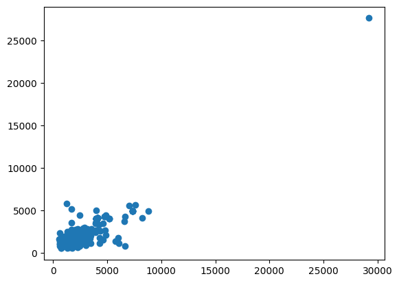
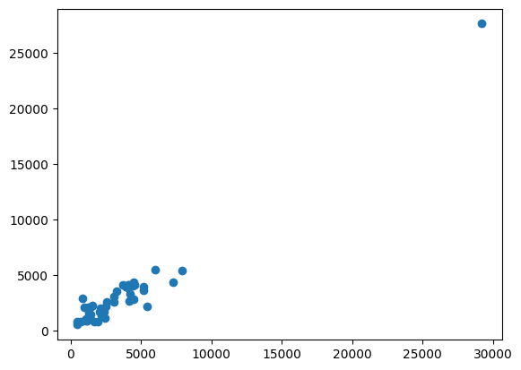
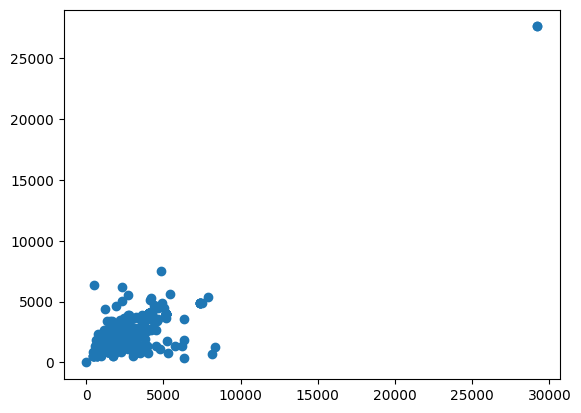
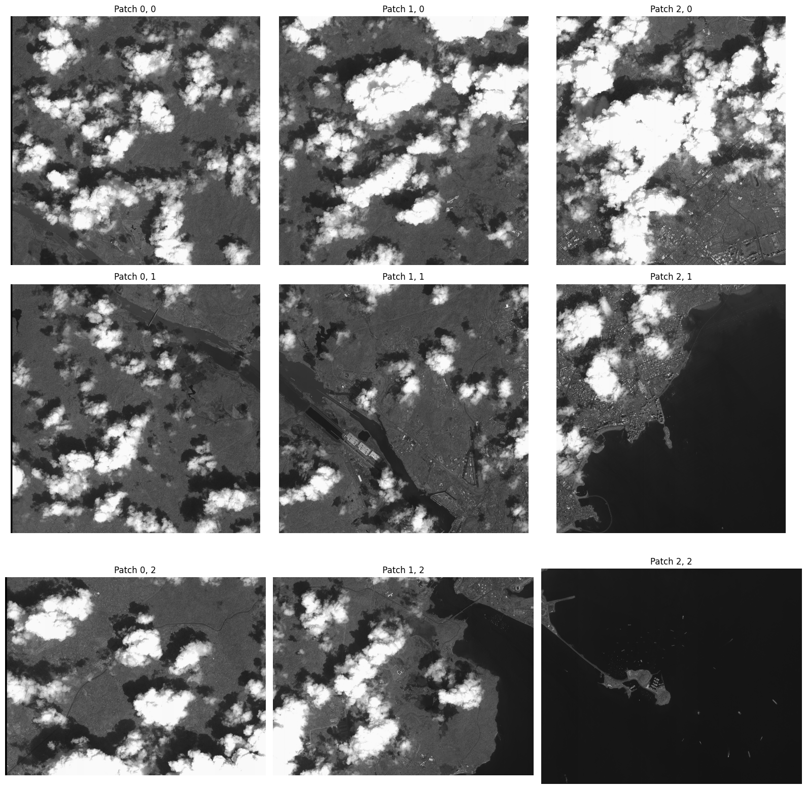
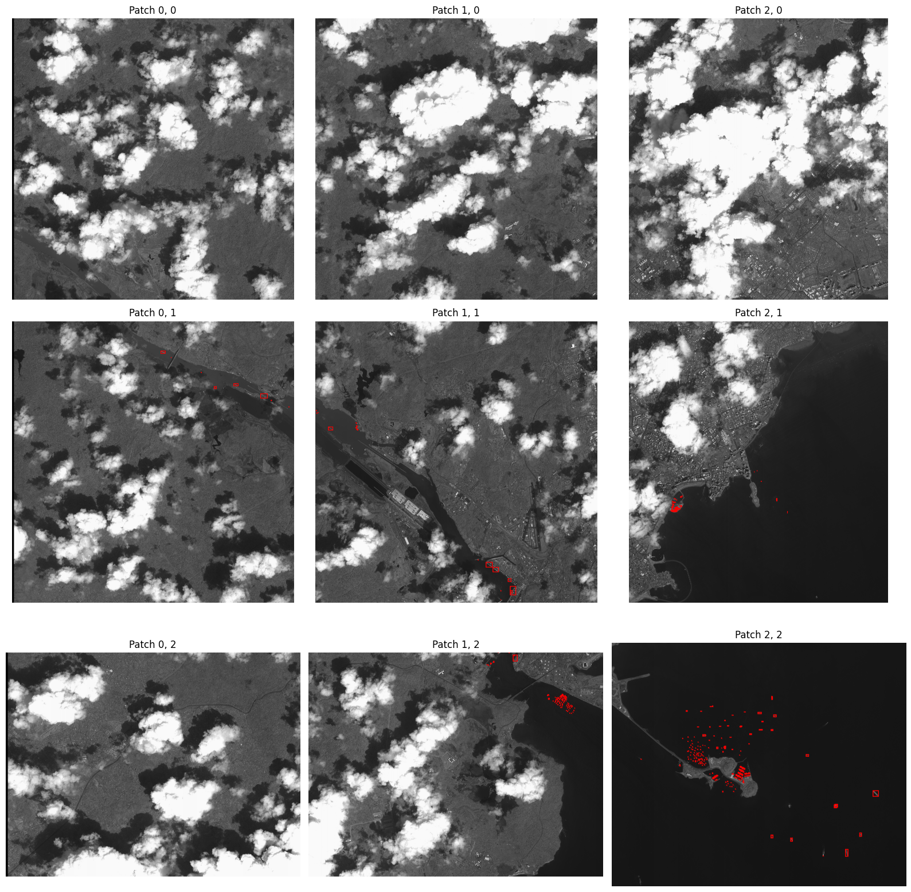

<!-- We will export the notebook file to markdown here -->
Previously we looked at the [data wrangling part](./ship-detection-competition-data-wrangling) of the competition where we converted the data annotations to darknet format. In this section, we will explore how we handled very large images. Our approach was to find the image outliers and split them into smaller images.

## The problem

Some of the images in the dataset are very large. Some were bigger than 25000x25000 pixels. We could have scaled down the images to a smaller size, but this would have meant that smaller ships would not have been visible.

## Finding outliers

To find the image size without loading the complete image, we will use `imagesize` library.

```sh
!pip install -q imagesize
```


```python
import os

import numpy as np
import matplotlib.pyplot as plt
import pandas as pd
from PIL import Image

from torchvision.io import read_image

import imagesize
```


```python
DATASET_LOC = "./ship-detection"
```


```python
train_loc = f"{DATASET_LOC}/train"
val_loc = f"{DATASET_LOC}/val"
test_loc = f"{DATASET_LOC}/test"
```


```python
def get_width_height(directory):
    widths, heights = [], []
    files = os.listdir(directory)
    for f in files:
        width, height = imagesize.get(os.path.join(directory, f))
        widths.append(width)
        heights.append(height)
    return np.array(widths), np.array(heights)
```


```python
train_widths, train_heights = get_width_height(f"{train_loc}/images")
```


```python
plt.scatter(train_widths, train_heights)
plt.show()
```


    

    


```python
val_widths, val_heights = get_width_height(f"{val_loc}/images")
```


```python
plt.scatter(val_widths, val_heights)
plt.show()
```


    

    


```python
test_widths, test_heights = get_width_height(f"{test_loc}")
```


```python
plt.scatter(test_widths, test_heights)
plt.show()
```


    

    


As we can see, most of there are huge images (>25000 width and/or height). We will split them later. But for now, we can modify our `get_width_height` function and get outliers


```python
def get_outliers(directory):
    outliers = []
    files = os.listdir(directory)
    for f in files:
        width, height = imagesize.get(os.path.join(directory, f))
        if width > 25000 or height > 25000:
            outliers.append(os.path.join(directory, f))
    return outliers
```


```python
train_outliers = get_outliers(f"{train_loc}/images")
val_outliers = get_outliers(f"{val_loc}/images")
test_outliers = get_outliers(f"{test_loc}")
```


```python
print(train_outliers)
print(val_outliers)
print(test_outliers)
```

    ['./ship-detection/train/images/133.png']
    ['./ship-detection/val/images/15.png']
    ['./ship-detection/test/265.png', './ship-detection/test/305.png']


Out of these outliers, train and val images need special attention. Not only do we need to split the images but we also need to split their annotations as well. So, let's load their annotations

## Loading Annotations


```python
# Reading annotations
annot_file = f"{train_loc}/metadata.jsonl"
```


```python
annotations = pd.read_json(path_or_buf=annot_file, lines=True)
annotations.head()
```


<div>
<table border="1" class="dataframe">
  <thead>
    <tr style="text-align: right;">
      <th></th>
      <th>file_name</th>
      <th>objects</th>
    </tr>
  </thead>
  <tbody>
    <tr>
      <th>0</th>
      <td>0.png</td>
      <td>{'bbox': [[6690, 3599, 7164, 3850], [6772, 338...</td>
    </tr>
    <tr>
      <th>1</th>
      <td>1.png</td>
      <td>{'bbox': [[613, 18, 619, 31], [668, 33, 681, 3...</td>
    </tr>
    <tr>
      <th>2</th>
      <td>2.png</td>
      <td>{'bbox': [[161, 489, 192, 506], [171, 630, 209...</td>
    </tr>
    <tr>
      <th>3</th>
      <td>3.png</td>
      <td>{'bbox': [[1889, 1463, 2283, 1526], [3953, 184...</td>
    </tr>
    <tr>
      <th>4</th>
      <td>4.png</td>
      <td>{'bbox': [[747, 2772, 769, 2787], [1007, 2040,...</td>
    </tr>
  </tbody>
</table>
</div>


Now we need to split the images. You can find the code in this repository (add repository)


```python
import importlib, split_image
importlib.reload(split_image)

from split_image import *
```

We split the images according to a `stride`. Let's visualize how it looks in different patches


```python
stride = 10000
```


```python
image = read_image(train_outliers[0])
image.shape
```


    torch.Size([3, 27620, 29200])


```python
patches = get_patches(image, stride)
```


```python
fig, ax = plt.subplots(len(patches), len(patches[0]), figsize=(16, 16))

for i in range(len(patches)): # going width wise
    for j in range(len(patches[i])): # going height wise
        ax[j, i].set_title(f"Patch {i}, {j}")
        ax[j, i].axis("off")
        ax[j, i].imshow(patches[i][j])
plt.tight_layout()
```


    

    


We can use `get_all_relative_annots` function to get annotations


```python
matrix_size = (len(patches[0]), len(patches))
file = train_outliers[0].split("/")[-1].split(".")[0]
bbox = read_annotation(file, annotations)
rel_annots = get_all_relative_annots(bbox, matrix_size, stride)
```


```python
fig, ax = plt.subplots(len(patches), len(patches[0]), figsize=(16, 16))

for i in range(len(patches)): # going width wise
    for j in range(len(patches[i])): # going height wise
        ax[j, i].set_title(f"Patch {i}, {j}")
        ax[j, i].axis("off")
        if rel_annots[i][j]:
            lbl_img = get_labeled_image(patches[i][j], torch.tensor(rel_annots[i][j]))
            ax[j, i].imshow(lbl_img.permute(1, 2, 0))
        else:
            ax[j, i].imshow(patches[i][j])
plt.tight_layout()
```


    

    


Some boats may lie in between two patches, we are ignoring them as they are very less in number.

## Splitting the outliers


```python
for t in train_outliers:
    split_image_annotations(t, annotations, stride)
```


```python
for v in val_outliers:
    split_image_annotations(v, annotations, stride)
```


```python
for test_image in test_outliers:
    split_test_image(test_image, stride)
```


Now we will move these in an outliers folder


```sh
!mkdir ship-detection/outliers
```


```python
outliers = train_outliers + val_outliers + test_outliers

outliers
```


```python
for src in outliers:
    file = src.split('/')[-1]
    dest = f"{DATASET_LOC}/outliers/{file}"
    shutil.move(src, dest)
```

Now we move the annotations for validation and training data


```python
outliers = train_outliers + val_outliers
outliers
```


```python
for outlier in outliers:
    file = outlier.split('/')[-1].split(".")[0]
    loc = "/".join(outlier.split("/")[:-2])
    src = f"{loc}/labels/{file}.txt"
    dest = f"{DATASET_LOC}/outliers/{file}.txt"
    shutil.move(src, dest)
```

Perfect, now we can move on to training the model in the next part.


|**Next Part: [Training the model](./ship-detection-competition-object-detection)**
