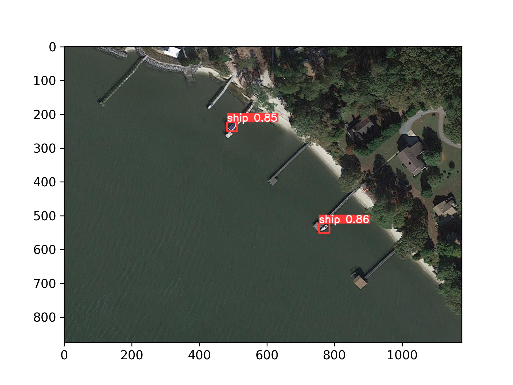

Previously we looked at [handling outlies](./ship-detection-competition-handling-outliers). These outliers would disrupt the objects if not split. In this section, we will see how to train **yolov5** for detection of ships. We will be using the ultralytics [yolov5](https://github.com/ultralytics/yolov5). 

## Creating `dataset.yaml`

To train `yolov5` we need to create a `dataset.yaml` file and pass it to the prompts. 

This file should contain the relative path to the dataset. It should also refer to `train`, `val` and `test` split. Test split is optional. After that, It should mention the names and labels of different classes in the dataset.

You can refer to this [link](https://docs.ultralytics.com/yolov5/tutorials/train_custom_data/#1-create-dataset) for more information.

The following works in our case:


```python
dataset_path = "../ship-detection"
train_path = "train"
val_path = "val"
test_path = ""

classes = {0:"ship"}
```


```python
names = ""
for k, v in classes.items():
    names += f"  {k}: {v}"
```


```python
yaml_text = f"""
path: {dataset_path}
train: {train_path}
val: {val_path}
test: {test_path}

names:
{names}
"""
```


```python
print(yaml_text)
```

    
    path: ../ship-detection
    train: train
    val: val
    test: 
    
    names:
      0: ship
    
    


```python
with open("dataset.yaml", "w") as file:
    file.write(yaml_text)
```

## Training the model

We will now clone the repository of [yolov5](https://github.com/ultralytics/yolov5).


```sh
!git clone https://github.com/ultralytics/yolov5.git
```
    

Now we need to install all the dependencies.

```sh
!pip install yolov5/requirements.txt
```

Now we can start training.
```sh
!python yolov5/train.py --imgsz 3008 --batch 1 --epochs 50 \
    --data dataset.yaml --weights yolov5l.pt --workers 4
```

Here, 
The `--imgsz` is the image size. `--batch` is the batch size. `--epochs` is the number of epochs to train. `--data` referes to the dataset.yaml file we created earlier. `--weights` tells the script what yolo weights to use. `--workers` are for the number of workers used when training.

The output is too big so we are omitting that. But it will show you where the model was saved like this:

>Results saved to **yolov5/runs/train/exp2**


## Inference


```python
import torch
import matplotlib.pyplot as plt
```


```python
exp_id = "2"
resolution = 3008
model = torch.hub.load('ultralytics/yolov5', 'custom', path=f"yolov5/runs/train/exp{exp_id}/weights/best.pt")
```


```python
model_result = model(f"ship-detection/val/images/6.png", size=resolution)
```

```python
%matplotlib inline
plt.imshow(model_result.render()[0])
plt.show()
```

    
